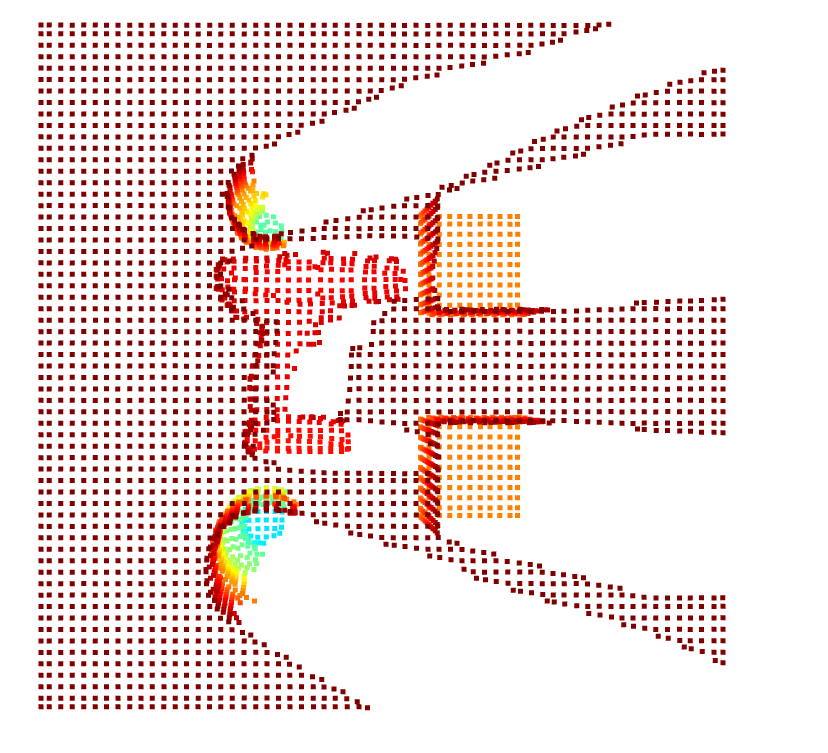
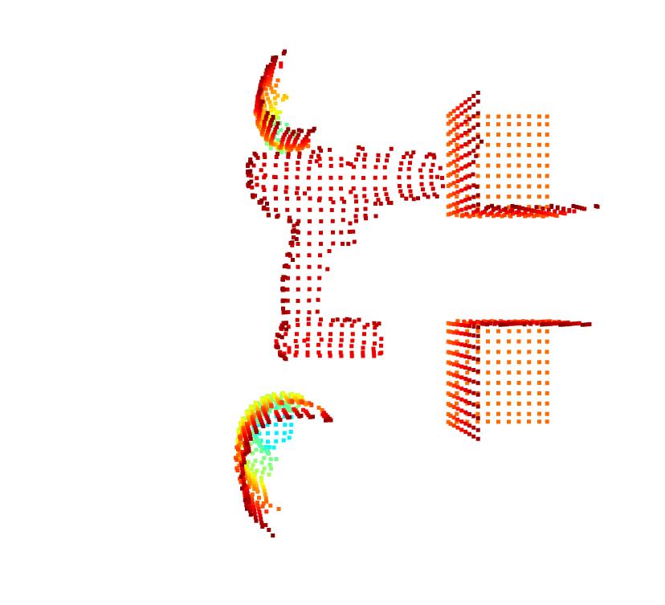
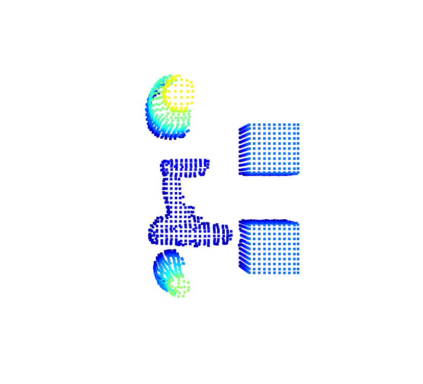
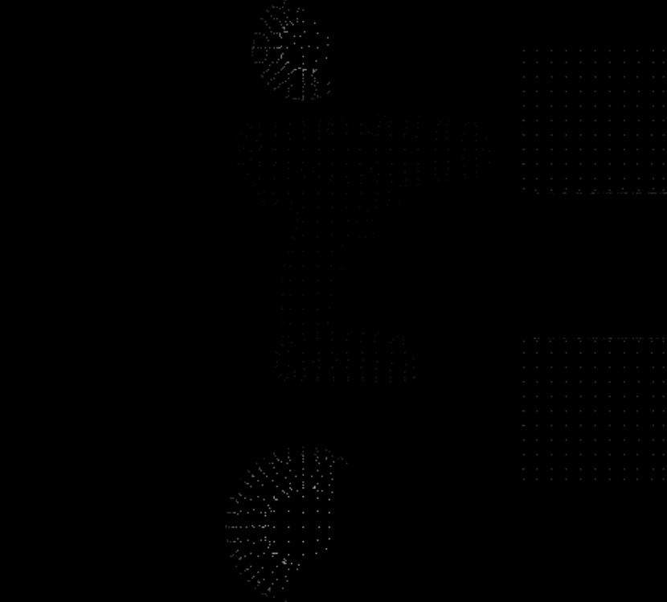

This script transforms points from the camera frame to the origin. This can be visualized in the image `i1.png`. Additionally, the depth image is converted to a point cloud simultaneously. Voxel decomposition is performed to obtain better downsampled data.

Next, the table is removed using the RANSAC algorithm for plane segmentation. This can be shown in the image `i2.png`.

Then, the frame is shifted to the top of the point cloud to achieve a top-down view using the transformation matrix `new_pose`. This transformation can be seen in the image `i3.png`.

Finally, the point cloud is converted back to a depth image, with the values normalized between the maximum and minimum Z values. The resulting image is a grayscale image, where white corresponds to points nearest to the camera and black represents points farther away. This can be visualized in the image `i4.png`.

## Images

### i1.png

### i2.png

### i3.png

### i4.png

